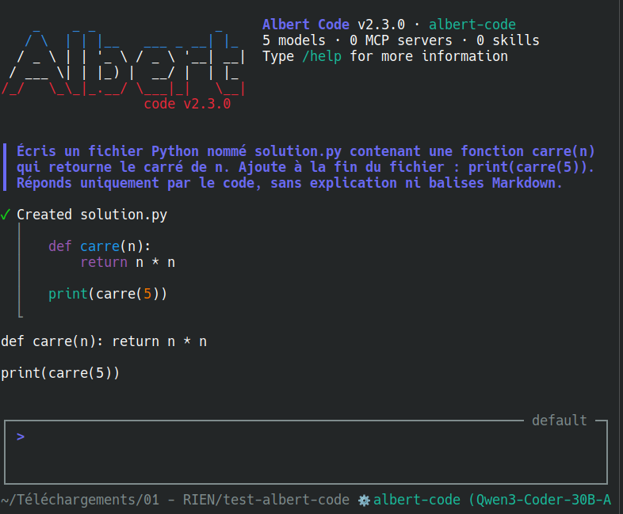

# Albert Code 🇫🇷

<p align="center">
  
</p>

**Assistant IA de programmation en ligne de commande, propulsé par l'API Albert.**

> ⚠️ **Projet non officiel et expérimental.** Ce projet n'est affilié ni à la DINUM ni à Mistral AI. Il s'agit d'un fork personnel de [Mistral Vibe](https://github.com/mistralai/mistral-vibe), adapté pour fonctionner avec l'[API Albert](https://albert.api.etalab.gouv.fr). Aucune garantie de stabilité ni de support.

## 1 - Obtention de la clé API Albert

1. Se rendre sur https://albert.sites.beta.gouv.fr/access/ et remplir le formulaire.
2. Attendre la réception de l'accès (quelques heures, 24 h au maximum).
3. Se connecter au Playground : https://albert.playground.etalab.gouv.fr/.
4. Créer une clé API et la copier (elle ressemble à `eyJhbGciOi...`).

> 💡 Pour le support des clés API, rejoindre le salon Tchap **Albert API - Support & retours utilisateurs**.

## 2 - Installation

Pré-requis : Python 3.12 ou supérieur.

```bash
git clone https://github.com/obook/albert-code.git
cd albert-code
./albert-code.sh
```

Le lanceur crée automatiquement un environnement virtuel Python (`.venv/`), installe les dépendances et démarre Albert Code. Au premier lancement, la clé API est demandée.

Sous Windows, utiliser `albert-code.bat` à la place de `albert-code.sh`.

> [!WARNING]
> **Sous Windows, Albert Code nécessite Windows Terminal pour afficher son interface.** L'invite de commande classique (`cmd.exe`) et la fenêtre PowerShell ouverte directement depuis le menu Démarrer ne savent pas afficher la TUI Textual ; l'application semble alors figée.
>
> ### Installation de Windows Terminal
>
> Windows Terminal est l'application de terminal moderne de Microsoft, gratuite. Sur Windows 11, elle est installée par défaut. Sur Windows 10, l'installation manuelle est nécessaire :
>
> 1. Ouvrir le **Microsoft Store** depuis le menu Démarrer.
> 2. Rechercher **Windows Terminal**, ou ouvrir directement le lien https://aka.ms/terminal (qui redirige vers la page Store https://apps.microsoft.com/detail/9n0dx20hk701).
> 3. Cliquer sur **Obtenir** ou **Installer**. L'opération prend quelques secondes.
>
> Pour les machines sans Microsoft Store, le `.msixbundle` de la dernière version est téléchargeable depuis la page des releases : https://github.com/microsoft/terminal/releases.
>
> ### Utilisation avec Albert Code
>
> 1. Lancer **Windows Terminal** depuis le menu Démarrer (icône noire ornée d'un chevron).
> 2. Par défaut, Windows Terminal ouvre un onglet **PowerShell** : ce comportement est normal et tout à fait approprié. PowerShell est un shell parfaitement compatible avec Albert Code. Windows Terminal n'est qu'un *conteneur de terminal* ; le shell qu'il héberge importe peu (PowerShell, cmd, WSL, etc. fonctionnent tous).
> 3. Se déplacer jusqu'au dossier d'Albert Code et lancer le `.bat` (le préfixe `.\` est requis sous PowerShell pour exécuter un script du dossier courant) :
>
>    ```powershell
>    cd C:\chemin\vers\albert-code
>    .\albert-code.bat
>    ```
>
> Pour confirmer que la session s'exécute bien dans Windows Terminal, taper la commande suivante : `echo $env:WT_SESSION`. La variable doit afficher un identifiant. Si elle est vide, la session n'est pas dans Windows Terminal.
>
> ### Sans Windows Terminal
>
> Le mode programmatique `albert-code.bat -p "votre prompt"` n'utilise pas la TUI et fonctionne dans n'importe quelle console (cmd.exe, PowerShell standard). Il convient aux usages scriptés mais ne fournit pas l'interface interactive.
>
> ### Menu d'installation
>
> Lancer `.\albert-code.bat` sans argument affiche un menu interactif :
>
> 1. **Lancer Albert Code** : démarre l'application normalement.
> 2. **Installer la commande dans le PATH utilisateur** : ajoute le dossier d'Albert Code au `PATH` afin que `albert-code` soit disponible depuis n'importe quel répertoire.
> 3. **Désinstaller la commande du PATH utilisateur** : retire l'entrée du `PATH` (le dossier et l'application restent en place).
> 4. **Quitter** : ferme le menu sans rien lancer.
>
> Avec des arguments (par exemple `albert-code.bat -p "..."` ou `albert-code.bat --version`), le menu est court-circuité et la commande s'exécute directement.

## 3 - Utilisation

```bash
cd projet/
/chemin/vers/albert-code/albert-code.sh
```

Taper `/help` pour afficher la liste de toutes les commandes disponibles. Quelques commandes spécifiques à Albert méritent d'être signalées :

- `/limits` (alias `/quota`) : affiche les quotas par routeur (rpm, rpd, tpm, tpd) lus depuis `/v1/me/info`.
- `/fallback` : active ou désactive le basculement automatique de modèle après deux 429 consécutifs (par défaut actif, bascule de `albert-code` vers `albert-large` pendant 60 s).
- `/status` : affiche les statistiques de la session (étapes, tokens, coût).

## Remerciements

Ce fork s'inspire du projet [AlbertCode](https://github.com/XenocodeRCE/AlbertCode) de **Simon Roux** pour plusieurs idées clés liées à l'API Albert : auto-fallback de modèle sur 429 répétés, jauge RPM, mode plan-first avec checkpoints, snapshots Git automatiques avant édition. Les implémentations dans ce fork sont indépendantes mais doivent beaucoup à ses choix de conception.

## Licence

Basé sur [Mistral Vibe](https://github.com/mistralai/mistral-vibe) - Apache 2.0. Voir [LICENSE](LICENSE).
